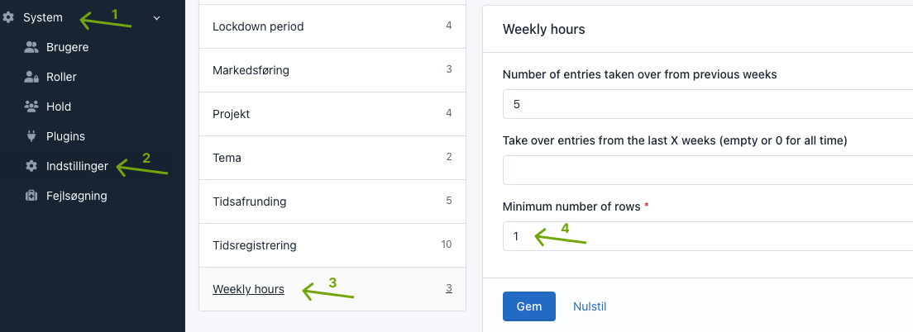
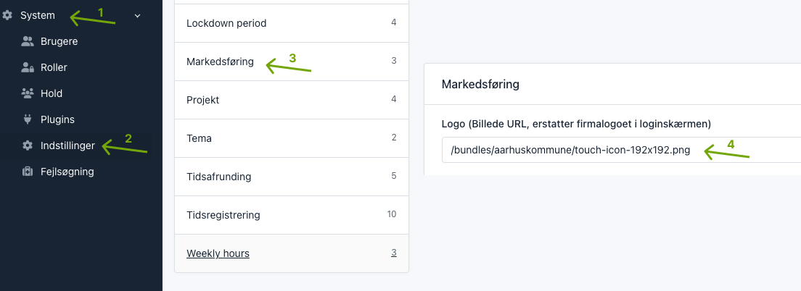
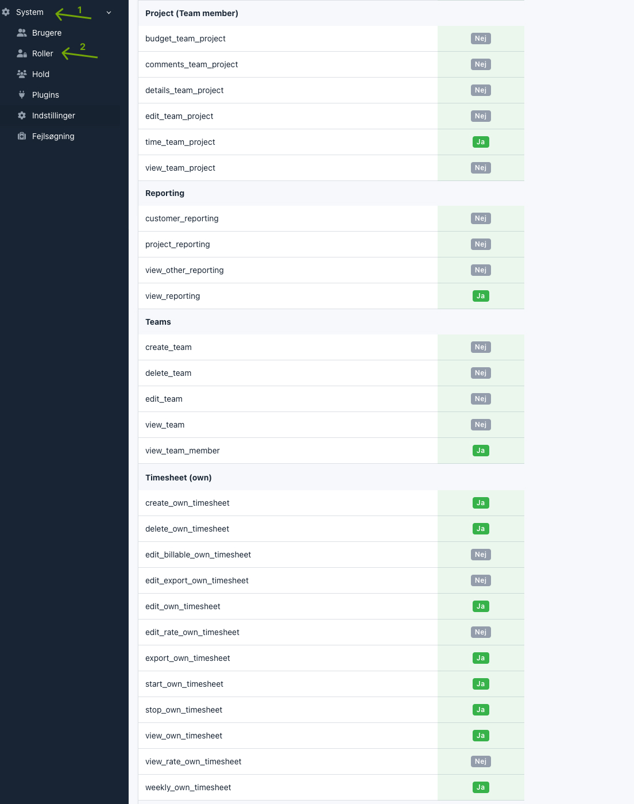

# Aarhus kommune – a Kimai plugin

## Installation

Download [a release](https://github.com/itk-kimai/AarhusKommuneBundle/releases) and extract it to `var/plugins/`.

```shell
# Install plugin assets in public/bundles/aarhuskommune (note it's "aarhuskommune" and not "aarhus_kommune").
# Use "/bundles/aarhuskommune/" as base path when referencing assets..
bin/console kimai:bundle:aarhus_kommune:install --no-interaction
bin/console doctrine:migrations:migrate --configuration=var/plugins/AarhusKommuneBundle/Migrations/aarhus_kommune.yaml --no-interaction
bin/console kimai:reload --no-interaction
```

See [Install and update Kimai plugins](https://www.kimai.org/documentation/plugin-management.html) for details.

Edit your [`local.yaml`](https://www.kimai.org/documentation/local-yaml.html#localyaml):

``` yaml
# config/packages/local.yaml
aarhus_kommune:
    primary_project: 87
    primary_activity: 42

    # Remove some main menu items by route:
    main_menu:
        remove:
            - route: dashboard
            - route: calendar

    # Web Accessibility Statement URL
    was_url: https://was.digst.dk/tid-aarhuskommune-dk

    user_defaults:
        # The default values.
        !php/const App\Entity\UserPreference::LANGUAGE: 'da'
        !php/const App\Entity\UserPreference::LOCALE: 'da'
        !php/const App\Entity\UserPreference::TIMEZONE: 'Europe/Copenhagen'
        !php/const App\Entity\UserPreference::SKIN: 'default'
        login_initial_view: 'quick_entry'

# Set route on Tabler logo
tabler:
    routes:
        tabler_welcome: quick_entry
```

Use `bin/console debug:config AarhusKommuneBundle` to check the active configuration.

## Features

### Login form

The username and password fields on the login form are hidden by default, but they can be summoned by adding
`#admin-login` to URL (i.e. `/en/login#admin-login`).

A login message can be defined on `/en/admin/system-config/#conf_aarhuskommune_config` and this message is shown on the
login form.

### Web Accessibility Statement

The path `/was` (route name: `aarhuskommune_was`) or `/{_locale}/was` (route name: `aarhuskommune_was_locale`) will
redirect to the Web Accessibility Statement URL defined in `local.yaml`.

### App template overrides

To override the app template `templates/partials/ticktack.html.twig`, say, create a template in
`Resources/views/app/partials/ticktack.html.twig`:

``` twig
{# Resources/views/app/partials/ticktack.html.twig #}

{# Use `@App` to refer to the original template #}
{{ include('@App/partials/ticktack.html.twig') }}
```

The path after `Resources/views/app/` _must_ match the path after `templates/partials/` exactly.

Another example:

``` twig
{# Resources/views/app/base.html.twig #}



    <div class="float-help">
        <a href="https://aarhuskommune.dk/tid" target="_blank" accesskey="h" title="{{ 'help'|trans }}">
            <i class="fas fa-question"></i>
        </a>
    </div>
    <div class="mb-4"></div>

```

## Development

``` shell
git clone --branch develop https://github.com/itk-kimai/AarhusKommuneBundle var/plugins/AarhusKommuneBundle
bin/console kimai:reload --no-interaction
```

Rather that hard copying plugin assets (cf. [Installation](#installation) above), you can run

``` shell
bin/console assets:install --symlink
```

to [symlink](https://en.wikipedia.org/wiki/Symbolic_link) the `public` folder.

### Coding standards

``` shell
docker run --rm --volume ${PWD}:/app --workdir /app itkdev/php8.3-fpm composer install
docker run --rm --volume ${PWD}:/app --workdir /app itkdev/php8.3-fpm composer normalize
docker run --rm --volume ${PWD}:/app --workdir /app itkdev/php8.3-fpm composer coding-standards-apply
docker run --rm --volume ${PWD}:/app --workdir /app itkdev/php8.3-fpm composer coding-standards-check
```

``` shell
docker run --rm --volume "$(pwd):/md" peterdavehello/markdownlint markdownlint --ignore LICENSE.md --ignore vendor/ '**/*.md' --fix
docker run --rm --volume "$(pwd):/md" peterdavehello/markdownlint markdownlint --ignore LICENSE.md --ignore vendor/ '**/*.md'
```

``` shell
docker run --rm --volume ${PWD}:/app --workdir /app itkdev/php8.3-fpm composer install
docker run --rm --volume ${PWD}:/app --workdir /app itkdev/php8.3-fpm composer code-analysis
```

_Note_: During development you should remove the `vendor/` folder to not confuse Kimai's autoloading.

## Configuration from the admin

The “Timetracking mode” must be set to “No tracking“ on `admin/system-config/#conf_timesheet`

### Weekly hours

We only want one row visible so we set "Minimum number of rows" to 1 in on `admin/system-config/#conf_quick_entry`



### App icon

Use a custom app icon for login and top of header.
Paste this `/bundles/aarhuskommune/touch-icon-192x192.png` path to the "Logo" field on `admin/system-config/#conf_branding`



### User permissions

We set these permissions for the user role. Everything else is disabled.


## Release

Whenever something is pushed to the `develop` branch, e.g. when merging a pull request, a [`develop`
pre-release](https://github.com/itk-kimai/kimai-plugin-AarhusKommuneBundle/releases/tag/release-develop ) is made (cf.
[.github/workflows/release-develop.yml](.github/workflows/release-develop.yml)).

To test creating a release, run

``` shell
docker run --tty --interactive --rm --volume ${PWD}:/app itkdev/php8.3-fpm:latest bin/create-release dev-test
```
